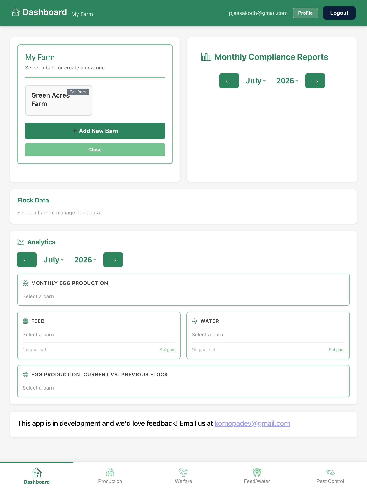
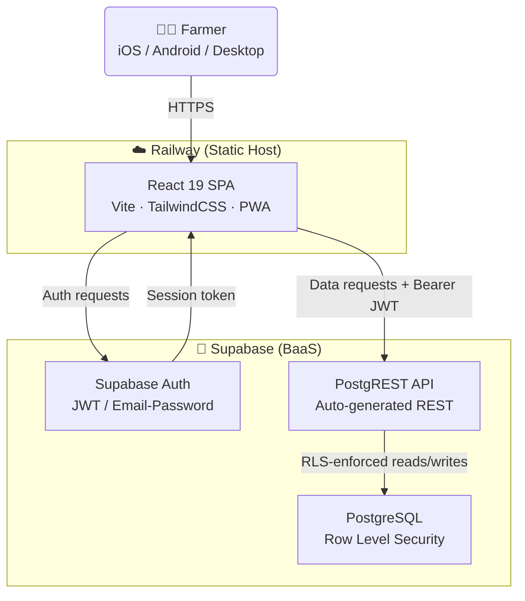

<div align="center">

# 🥚 SCSC Compliance Tracker

**Digital compliance record-keeping for Canadian egg farmers**

*Built for the [Start Clean Stay Clean (SCSC)](https://www.eggs.ca/producers/on-farm-programs) program — administered by Egg Farmers of Canada — replacing paper binders with a mobile-friendly, always audit-ready Progressive Web App.*

</div>

---

## 📸 Screenshot



---

## 🛠 Tech Stack

<table>
  <tr>
    <th>Layer</th>
    <th>Technologies</th>
  </tr>
  <tr>
    <td align="center"><b>🖥 Frontend</b></td>
    <td>
      
      
      
      
      
    </td>
  </tr>
  <tr>
    <td align="center"><b>⚙️ Backend</b></td>
    <td>
      
      
      
    </td>
  </tr>
  <tr>
    <td align="center"><b>🗄 Database</b></td>
    <td>
      
    </td>
  </tr>
  <tr>
    <td align="center"><b>☁️ Hosting</b></td>
    <td>
      
    </td>
  </tr>
  <tr>
    <td align="center"><b>🧪 Testing</b></td>
    <td>
      
    </td>
  </tr>
  <tr>
    <td align="center"><b>📄 PDF Reports</b></td>
    <td>
      
      
    </td>
  </tr>
</table>

---

## 🏗 Architecture

The app follows a **serverless, client-driven architecture** — no custom backend server. The React SPA talks directly to Supabase, which handles the database, auto-generated REST API, and authentication.



### Data ownership chain

Every database table has Row Level Security enabled. Data access cascades strictly from the authenticated user down through their farm:

```
auth.uid() → farms → barns → monthly_audits → form records
```

No user can ever read or write another farm's data — this is enforced at the database level, not just in application code.

---

## 📋 What it tracks

The app digitises the four SCSC compliance forms required of all licensed Canadian egg producers:

| Form | Area | Frequency |
|------|------|-----------|
| Form 07 | Production & Cooler Records — egg output, floor eggs, cooler temps, sanitation, flock age, thermometer calibration | Daily |
| Form 08 | Welfare Records — daily barn checks, weekly 15-point inspection, monthly ammonia/alarm/generator | Daily / Weekly / Monthly |
| Form 09 | Feed & Water Records — actuals vs. targets, mortality, health events | Daily |
| Form 10 | Pest Control Records — trap checks, bait monitoring, rodent index calculation, range inspections | As performed / Monthly |

Plus a cross-form **Corrective Action Log**, on-demand **PDF report generation**, and an **Analytics Dashboard** with feed, water, and egg production charts.

---

## 🚀 Run locally

```bash
npm install        # Install dependencies
npm run dev        # Start dev server
npm run build      # Build production bundle
npm run test:e2e   # Run Playwright end-to-end tests
```

---

## 🚂 Railway deployment — lockfile note

Railway builds with Node 20 / npm 10. When dependencies change, regenerate the lockfile with npm 10 before committing:

```bash
npm run lockfile:railway   # Regenerate package-lock.json with npm 10
npm run lockfile:check     # Verify the lockfile is clean
```

Then commit `package-lock.json` (and `package.json` if it changed). This prevents `npm ci` failures on Railway caused by missing transitive dependencies.

---

## 📱 Install on mobile (PWA)

No app store required. Install directly from the browser:

- **iPhone (Safari):** Share → Add to Home Screen
- **Android (Chrome):** Menu → Install App (or Add to Home Screen)

Share the Railway URL by text; recipients install from that link. Once installed, the app icon appears on the home screen and runs in standalone mode. Updates deploy automatically — users always get the latest version.

---

<div align="center">

Built by **KoMoPa Dev** · Questions or feedback? [komopadev@gmail.com](mailto:komopadev@gmail.com)

</div>
